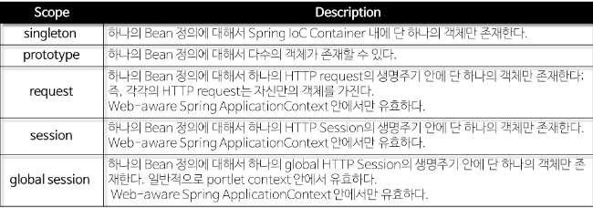

# Spring
> # RequestContextHolder
> Spring 에서 Request에 대한 정보를 가져오고자 할 때 사용하는 유틸성 클래스.
> 

> # Spring Bean
> Spring에서 POJO(Plain, Old Java Object)를 'Beans'라고 부른다.
> Beans는 Spring IOC Container에 의해 인스턴스화, 관리, 생성된다.
> Beans는 우리가 컨테이너에 공급하는 설정 메타 데이터(XML 파일)에 의해 생성된다.
컨테이너는 이 메타 데이터를 통해 Bean의 생성, Bean Life Cycle, Bean Dependency(종속성) 등을 알 수 있다.
> ## Spring Bean 정의
> 일반적으로 XML 파일에 정의한다.
 
주요 속성
 
> * class(필수): 정규화된 자바 클래스 이름
> * id: bean의 고유 식별자
> * scope: 객체의 범위 (sigleton, prototype)
> * constructor-arg: 생성 시 생성자에 전달할 인수
> * property: 생성 시 bean setter에 전달할 인수
> * init method와 destroy method
> ## Spring Bean Scope
> Spring은 기본적으로 모든 Bean을 Singleton으로 생성하여 관리한다.
>   > Singleton : 애플리케이션 구동 시 JVM안에서 Spring이 Bean마다 하나의 객체를 생성하는것
>   > request, session, global session의 Scope는 일반 Spring 어플리케이션이 아닌, Spring MVC Web Application에서만 사용된다.
>   > 
> ### Singleton
> 'singleton' Bean은 Spring 컨테이너에서 한번 생성된다.
>   > 컨테이너가 사라질 때 bean도 제거된다.
> 생성된 하나의 인스턴스는 single beans cache에 저장되고, 해당 Bean에 대한 요청과 참조가 있으면 캐시된 객체를 반환한다.
 
>   > 즉 여러곳에서 요청이 들어와도 하나의 객체를 참조한다.
> ### Prototype
> 'prototype' bean은 모든 요청에서 새로운 객체를 생성하는 것을 의미한다.
>   > 즉, prototype bean은 의존성 관계의 bean에 주입 될 때 새로운 객체가 생성되어 주입된다.
 
>   > 정상적인 방식으로 gc(Garbage Collection)에 의해 bean이 제거된다.

 
 
2022-09-07 Error 해결
Error : API-server 에서 로그인 로직 실행 시 local Redis server에 session 저장 error

원인 : 2개의 redis가 설치되어있었다.

wsl 에서 설치한 redis(docker 연결),내가 window용으로 설치한 redis. API-server는 전자의 redis에 연결되어있었고,

나는 계속 후자의 redis DB에서 session data 를 검색해서 나오지 않았던것.