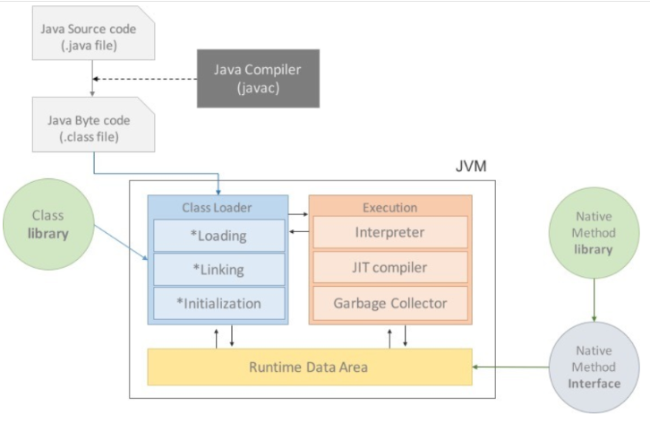

# JVM (Java Virtual Machine)
Java는 OS에 종속적이지 않다. -> OS에 종속받지 않고 실행되어야 한다. -> OS 위에서 Java를 실행시킬 무언가가 필요하다. -> JVM
***
Java Source Code (\*.java)는 CPU가 인식을 못하기 때문에 기계어로 컴파일을 해줘야한다.
 하지만 java는 jvm을 거쳐서 OS에 도달하기 때문에 기계어로 컴파일되는게 아니라
  \*.java -> Java byteCode(*.class)(JVM이 인식할 수 있는 파일) -> 바이너리 코드
  로 변환된다.

Java compiler(javac.exe) 가 .java 파일을 .class 라는 java bytecode로 변환한다.
* 자바 컴파일러에 의해 변환된 코드의 명령어 크기가 1바이트라서 자바 바이트 코드라고 불리고 있다.(총 256개의 명령어)

자바 컴파일러에 의해 변환된 .class 파일은 다시 실시간 번역기 또는 JIT 컴파일러에 의해 OS(CPU)가 읽을 수 있는 바이너리 코드로 변환된다.

## Constant Pool

JVM은 Host OS 의 메모리를 최대한 효율적으로 이용하도록 설계가 되어있다.

이를 위해서 JVM은 Constant Pool 이라는 전략을 사용하는데, JVM이 동적으로 코드를 실행시킬 때 모든 데이터를 즉시 생성하는 것이 아니라 Constant Pool 에 저장하고 Constant Pool 에 존재하는 데이터를 우선적으로 가져와 메모리를 더욱 효율적으로 사용할 수 있게 되는 것이다.

## Instruction Set

자바 바이트코드는 컴파일된 결과로 생성되는 코드 이므로 일종의 명령어 집합이라고 할 수 있다.

이를 JVM Instruction Set 이라고 한다.

명령어는 당연하게 OpCode와 Operands 로 구성되는데 자바 바이트코드에서는 1 Byte의 OpCode와 2 Byte의 Operands 로 구성된다.

1 Byte의 OpCode 이므로 사용가능한 총 명령어의 수는 256개가 되고 자세한 명령어의 정의는 Oracle Java Bytecode Instruction Set Docs 에서 확인할 수 있다.

## JIT 컴파일러
* just-in-time compliation

JIT 컴파일러는 프로그램을 실제 실행하는 시점에 기계어로 번역하는 컴파일러이다.

인터프리터 방식의 단점을 보완하기 위해 도입되었다.

인터프리터 방식으로 실행하다가 적절한 시점에 바이트 코드 전체를 컴파일하여 기계어로 변경하고, 이후에는 더 이상 인터프리팅 하지 않고 기계어로 직접 실행하는 방식이다.

자바에선 자바 컴파일러가 자바 프로그램 코드를 바이트 코드로 변환한 다음,
실제 바이트 코드를 실행하는 시점에서 자바 가상 머신(JVM, 정확히는 JRE)이 바이트 코드를 JIT 컴파일을 통해 기계어로 변환한다.

## JVM 구성요소

* Class Loader
* Execution Engine (실행엔진)
* * Interpreter
* * JIT compiler
* * Garbage Collector
* Runtime Data Area

## Class Loader(클래스로더)

JVM 내로 .class 파일을 로드하고, 링크를 통해 배치하는 작업을 수행하는 모듈

런 타임시 동적으로 클래스를 로드하고, jar 파일 내 저장된 클래스들을 JVM 위에 탑재한다.

즉, 클래스를 처음으로 reference할 때 해당 클래스를 로드하고 링크하는 역할을 한다.

## Execution Engine(실행엔진)
클래스를 실행시키는 모듈이다.

Class Loader가 JVM 내의 Runtime data Area에 바이트코드를 배치시키고, 이것은 실행엔진에 의해 실행된다.

즉, Execution Engine은 Java byte code(\*.class) 를 기계가 실행할 수 있는 형태로 변경한다.

#### Interpreter
실행엔진은 자바 바이트 코드를 명령어 단위로 읽어서 실행.

! 한줄씩 실행하기 때문에 느리다는 단점이 있다.

#### JIT
인터프리터 방식으로 실행하다가 적절한 시점에 바이트 코드 전체를 컴파일하여 기계어로 변경하고, 이후에는 더이상 인터프리팅 하지 않고 기계어로 직접 실행하는 방식이다.

#### Garbage Collector
더이상 사용되지 않는 인스턴스를 찾아 메모리에서 삭제한다.

## Runtime data area(런타임 데이터 영역)
### 프로그램을 수행하기 위해 OS로부터 할당받은 메모리 공간

* PC Register 영역

Thread(쓰레드) 가 시작될 때 생성되는 공간으로 쓰레드마다 하나씩 존재한다.
Thread가 어떤 부분을 어떤 명령으로 실행해야 할 지에 대한 기록을 하는 부분으로
현재 수행중인 JVM 명령의 주소를 갖는다.

* JVM Stack 영역

프로그램 실행과정에서 임시로 할당되었다가 메소드를 빠져나가면 바로 소멸되는 특성의 데이터를 저장하기 위한 영역

각종 형태의 변수나 임시 데이터, 스레드나 메소드의 정보를 저장한다.

메소드 호출 시마다 각각의 스택 프레임(그 메서드만을 위한 공간)이 생성된다. 메서드 수행이 끝나면 프레임 별로 삭제를 한다.

메소드 안에서 사용되는 값들을 저장한다. 또 호출된 메소드의 매개변수, 지역변수, 리턴 값 및 연산 시 일어나는 값들을 임시로 저장한다.

* Native method stack 영역

자바 프로그램이 컴파일되어 생성되는 바이트 코드가 아닌 실제 실행할 수 있는 기계어로 작성된 프로그램을 실행시키는 영역.

JAVA가 아닌 다른 언어로 작성된 코드를 위한 공간.

Java Native Interface를 통해 바이트 코드로 전환하여 저장하게 된다.

일반 프로그램처럼 커널이 스택을 잡아 독자적으로 프로그램을 실행시키는 영역

* Heap 영역

객체를 저장하는 가상메모리 공간. new 연산자로 생성되는 객체와 배열을 저장한다.

Class Area(Static Area)에 올라온 클래스들만 객체로 생성할 수 있다.

힙은 세 부분으로 나뉘어 진다.
* Permanent Generation(영구적인 세대)

생성된 객체들의 정보의 주소값이 저장된 공간이다. 클래스 로더에 의해 load되는 Class, Method 등에 대한 Meta 정보가 저장되는 영역이고 JVM에 의해 사용된다.

Reflection을 사용하여 동적으로 클래스가 로딩되는 경우에 사용된다.

* * Reflection 이란 : 객체를 통해 클래스의 정보를 분석해 내는 프로그래밍 기법.
구체적인 클래스 타입을 알지 못해도, 컴파일된 바이트 코드를 통해
역으로 클래스의 정보를 알아내어 사용할 수 있다는 뜻

* New/Young 영역

이곳의 인스턴스들은 추후 가비지 콜렉터에 의해 사라진다.

생명 주기가 짧은 “젊은 객체”를 GC 대상으로 하는 영역이다.

여기서 일어나는 가비지 콜렉트를 Minor GC 라고 한다.

* * Eden : 객체들이 최초로 생성되는 공간
* * Survivor 0, 1 : Eden에서 참조되는 객체들이 저장되는 공간
    * Eden 영역에 객체가 가득차게되면 첫번째 가비지 콜렉트가 발생한다.
    * Eden영역에 있는 값등릉 Survivor 1 영역에 복사하고 이 영역을 제외한 나머지 객체를 삭제한다.
* * Old : 이곳의 인스턴스들은 추후 가비지 콜렉터에 의해 사라진다.
생명 주기가 긴 “오래된 객체”를 GC 대상으로 하는 영역이다.
여기서 일어나는 가비지 콜렉트를 Major GC 라고 한다. Minor GC에 비해 속도가 느리다.
New/Young Area에서 일정시간 참조되고 있는, 살아남은 객체들이 저장되는 공간이다.

* Method Area(= Class Area = Static Area)

클래스 정보를 처음 메모리 공간에 올릴 때 초기화되는 대상을 저장하기 위한 메모리 공간

* * Static Area 에 저장되는 데이터
    * Field Information (멤버 변수!)
        * 멤버변수의 이름, 데이터 타입, 접근 제어자에 대한 정보
    * Method Information (메소드!)
        * 메소드의 이름, 리턴타입, 매개변수, 접근 제어자에 대한 정보
    * Type Information (타입!)
        * class인지 interface인지의 여부 저장. Type의 속성, 전체 이름, super 클래스의 전체 이름. (interface이거나 object인 경우 제외된다. 이건 Heap에서 관리함)

* Runtime Constant Pool

Static Area에 존재하는 별도의 관리 영역.
상수 자료형을 저장하여 참조하고 중복을 막는 역할

 
 

# String
 String 은 자바에서 제공하는 특별한 자료형이다.

 String을 생성하는 방법에는 2가지가 있다.

 * String A = "..." <- leteral을 이용하는 방법
 * new 연산자를 통해 String 객체의 생성자로 value 주입 방법

 자바에서 모든 String은 Constant(상수) 형태로 한번 생성이 되면 Update라는 개념이 사라진다.

 ### 즉 Java의 String 은 Immutable 이라고 할 수 있다.

 String 이 Java 에서 Immutable 한 이유 :

 * 캐싱

 JVM이 String Constant Pool 이라는 영역을 만들고 문자열들을 Constant 화 하여 다른 변수 혹은 객체들과 공유하게 되는데, 이 과정에서 데이터 캐싱이 일어나고 그 만큼 성능적 이득을 취할 수 있다.

 * 동기화

일단 어떤 데이터든 Immutable 하다면 Multi-Thread 환경에서 동기화 문제가 발생하지 않기 때문에 더욱 safe 한 결과를 낼 수 있다.

 * 보안성

String을 변경할 수 없도록 만들지 않으면 애플리케이션에 심각한 보안 위협이 됩니다. 예를 들어 데이터베이스 사용자 이름, 암호는 데이터베이스 연결을 수신하기 위해 문자열로 전달됩니다. 소켓 프로그래밍 호스트 및 포트 설명도 문자열로 전달됩니다. String은 변경할 수 없으므로 값을 변경할 수 없습니다. 문자열이 변경 불가능한 상태로 유지되지 않으면 해커가 참조 값을 변경하여 애플리케이션에 보안 문제를 일으킬 수 있습니다.

## String Constant Pool

String은 한번 사용되면 재사용될 확률이 높기 때문에 효율성을 높이기 위해 Heap영역 내에 문자열 상수의 Pool을 유지하고, 해당 Pool로 사용자가 정의한, 변수가 가지고 있는 value를 담게된다.

### 그럼 모든 String 이 Constant Pool 에서 값을 가져올까?

아니다. String Constant Pool 을 이용하기 위해서는 앞서 본 2가지 String 생성 방법 중 Literal을 이용한 방법으로만 가능하다.