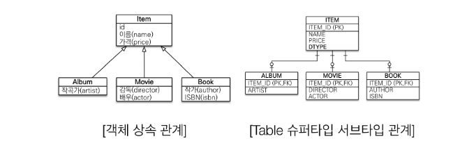

# JPA 와 ORM
## ORM(Object-Relational Mapping) 이란
* 객체는 객체대로 설계하고, 관계형 데이터베이스는 관계형 데이터베이스대로 설계한다.
* ORM 프레임워크가 중간에서 매핑해준다.
* ORM은 객체와 RDB 두 기둥 위에 있는 기술이다.
## JPA(Java Persistence API) 란
* 현재 자바진영의 ORM 기술 표준으로, Interface의 모음이다.
* Interface 이기 때문에, 구현은 사용자가 해야한다.
* JPA Interface를 구현한 대표적인 Opensource가 Hibernate이다.
    * Hibernate란
        * ORM Framework
        * OpenSource
        * EJB를 대체할 목적으로 개발되었다.
            * EJB란
                * 과거의 자바 표준(Enterprise Java Bean)
                * 과거의 ORM
                * 문제점 :
                    * 코드가 매우 지저분하다.
                    * API 복잡성이 높다.
                    * 속도가 느리다.
* JPA 2.1 표준 명세를 구현한 3가지 구현체 : Hibernate, EclipseLink, DataNucleus

### JPA 동작 과정
* JPA는 애플리케이션과 JDBC 사이에서 동작한다.
    * JDBC(Java Database Connectivity)란
        * 자바에서 DB 프로그래밍을 하기위해 사용되는 API
    * JDBC 동작 흐름
        * JDBC 드라이버
            * DBMS와 통신을 담당하는 Java class
            * DBMS별로 알맞은 JDBC 드라이버 필요(jar)
                * JAR(Java Archive Files) 란
                    * 일종의 자바 프로젝트 압축 파일
                    * Jar파일은 웹브라우저에서 빠르게 다운로드할수있도록 클래스, 이미지 및 사운드 파일을 하나의 파일에 압축하여 담고있는 파일이다.
        * JDBC URL
            * DBMS와의 연결을 위한식별 값
            * 구성 : jdbc:[DBMS]:[데이터베이스식별자]
    * 개발자가 JPA를 사용하면, JPA 내부에서 JDBC API를 사용하여 SQL을 호출하여 DB와 통신한다.
    * 즉, 개발자가 직접 JDBC API를 사용하는것은 아니다.
* 저장 과정
    * 예) MemberDAO에서 객체를 저장하고 싶을 때
        * 개발자는 JPA에 Member 객체를 넘긴다.
        * Jpa는
            1. Member Entity를 분석한다.
            2. Insert SQL을 생성한다.
            3. JDBC API를 사용하여 SQL을 DB에 날린다.
* 조회 과정
    * 예) Member객체(Object)를 조회하고 싶을 때
        * 개발자는 Member의 PK 값을 JPA에 넘긴다.
        * Jpa는
            1. 엔티티의 매핑정보를 바탕으로 적절한 SELECT SQL을 생성한다.
            2. JDBC API를 사용해 SQL을 DB에 날린다.
            3. DB로 부터 결과를 받아온다.
            4. 결과(ResultSet)을 객체에 모두 매핑한다.
        * \*쿼리를 JPA가 만들어 주기 때문에 Object와 RDB간의 패러다임 불일치를 해결할수있다.
            * 패러다임 불일치란
                * 객체지향프로그래밍은 상속, 다형성, 캡슐화등의 특성을 가지고있다.
                * RDB는 데이터중심으로 구조화 되어있다.
                * 즉, 자바언어는 객체지향으로 이뤄져있고 데이터베이스는 데이터중심으로 구조화되어있기 때문에 자바의 객체를 데이터베이스에 저장하려면 개발자가 코드를 짜서 패러다임불일치 문제를 해결해야한다.
### JPA 장점
1. SQL 중심적인 개발에서 객체중심으로 개발
2. 생산성
    * JPA를 사용하면 CRUD가 간편하다. 특히 수정(Update)가 간단하다.
        * Create : jpa.persist(obj)
        * Read : Object obj = jpa.find()
        * Update : member.setter("update") 객체를 변경하면 알아서 DB에 Update Query가 나간다.
        * Delete : jpa.remove(obj)
3. 유지보수
    * 기존 : 필드(컬럼)변경 시 모든 SQL을 수정해여한다.
    * Jpa : 필드만 추가하면된다. SQL은 JPA가 처리하기 때문에.
4. Object - RDB 패러다임 불일치 해결
    1. JPA와 상속
    
        * 저장
            * 개발자가 할 일
                * jpa.persist(album)
            * Jpa do
                * INSERT INTO ITEM
                * INSERT INTO ALBUM
        * 조회
            * 개발자가 할 일
                * Album album = jpa.find(Album.class, albumId);
            * Jpa do
                * SELECT I.*, A.* FROM ITEM I JOIN ALBUM A ON I.ITEM_ID = A.ITEM_ID
    2. JPA 연관관계
        * 객체의 참조로 연관관계 저장 가능
            * 예)
                * member.setTeam(team);
                * jpa.persist(member);
        * JPA에서 가장 중요한것 : Obj-RDB가 어떻게 Mapping되는지 이해하는것
            * 1차원적인 매핑
                * @Entity, @Column, @id 등 객체와 DB사이의 일대일로 대응되는것
            * 연관 관계 매핑
                * 방향 : 단방향, 양방향
                    * DB Table은 외래키 하나로 양쪽 테이블 join이 가능하다.
                    * 객체는 참조용 필드가 있는 객체만 다른 객체를 참조하는것이 가능하다.
                    * 양방향은 정확히 말하면 두 객체가 단방향 참조를 각각 가져서 양방향 관계처럼 사용하는것.
                    * 객체 입장에서 양방향 매핑을 했을 때 오히려 복잡해질 수 있다.
                    * 예)
                        * 일반적으로 User 엔티티는 굉장히 많은 엔티티와 연관관계를 갖는다.
                        * 모든 엔티티를 양방향관계로 설정하면 User 엔티티는 엄청나게 많은 테이블과 연관관계를 맺게되고 User 클래스는 엄청나게 복잡해진다.
                        * 다른 엔티티들도 불필요한 연관관계 매핑으로 횽
                * 연관 관계의 주인 : 양방향일 때, 연관관계에서 관리 주체
                * 다중성 : N:1, 1:N, 1:1, N:M

    3. JPA와 객체그래프 탐색